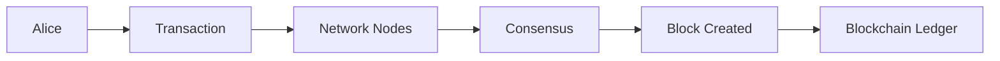
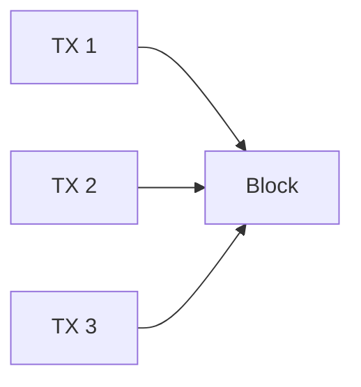
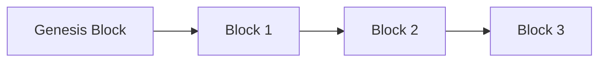
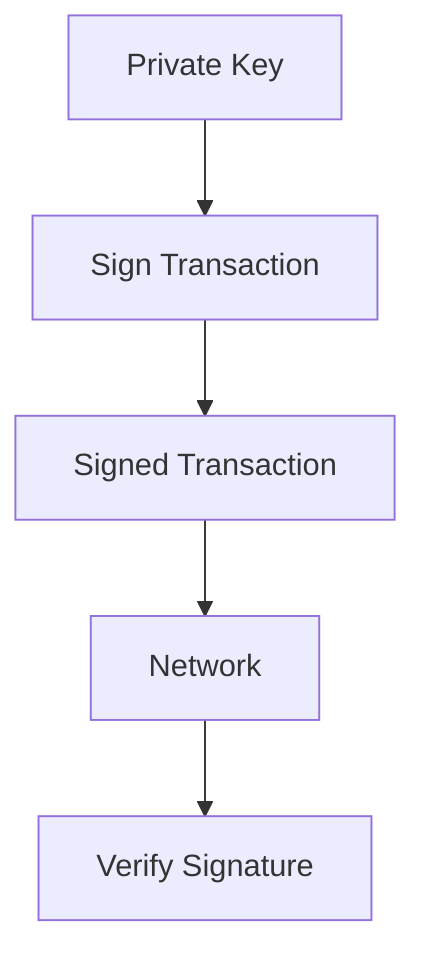
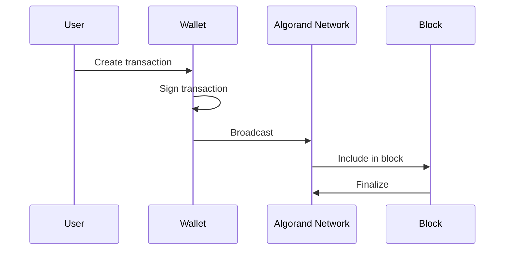
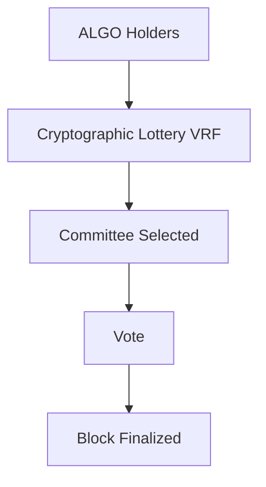
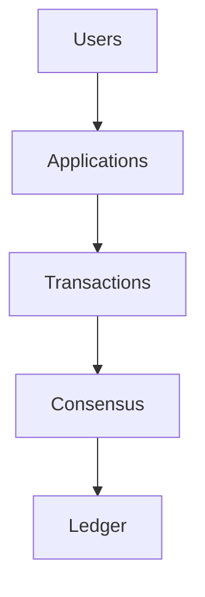

# Week 1 Study Material: Blockchain & Algorand Foundations

## Objective
By the end of Week 1, you should understand:

- What a blockchain is
- Why blockchains exist
- Public/private key cryptography
- Accounts and wallets
- Transactions and signatures
- Blocks and ledgers
- How Algorand differs from Bitcoin and Ethereum

---

# Chapter 1: Why Blockchain Exists

Before blockchain, digital systems had a trust problem.

Example:

Alice wants to send money to Bob.

Traditionally:

```text
Alice -> Bank -> Bob
```

The bank is the trusted intermediary.

Blockchain removes the intermediary.

```text
Alice -> Blockchain Network -> Bob
```

The network itself becomes the source of trust.

## Key Idea

A blockchain is:

> A distributed, append-only ledger maintained by a decentralized network.

---

# Blockchain Architecture



---

# Chapter 2: Core Terminology

## Ledger

A ledger is simply a record of transactions.

Example:

```text
Alice -> Bob    5 ALGO
Bob   -> Carol  2 ALGO
Carol -> Dave   1 ALGO
```

---

## Block

Transactions are grouped into blocks.



---

## Blockchain

Blocks are linked together.



Each block references the previous one, creating an immutable chain.

---

# Chapter 3: Cryptography Basics

## Private Key

The secret that controls an account.

```text
Never share it.
```

---

## Public Key

Derived from the private key.

Can be shared freely.

---

## Address

A human-usable representation of the public key.

```text
Private Key
     ↓
Public Key
     ↓
Address
```

---

# Cryptographic Ownership Model



---

# Chapter 4: Wallets and Accounts

## Wallet

Stores keys.

Examples:

- Pera Wallet
- Defly Wallet
- Ledger Hardware Wallet

## Account

Represents a blockchain identity.

Contains:

- Address
- Balance
- Assets
- Application state

---

# Chapter 5: Transactions

A transaction changes blockchain state.

Examples:

- Send ALGO
- Create Asset
- Transfer Asset
- Call Smart Contract

---

# Transaction Lifecycle



---

# Chapter 6: Consensus Overview

Consensus answers:

> Which block is the next valid block?

Without consensus:

```text
Node A says Block X
Node B says Block Y
Node C says Block Z
```

With consensus:

```text
Everyone agrees on Block X
```

---

# Comparing Major Chains

## Bitcoin

Consensus:

```text
Proof of Work
```

Characteristics:

- Mining
- High energy usage
- Slow finality

---

## Ethereum

Consensus:

```text
Proof of Stake
```

Characteristics:

- Validators stake ETH
- Smart contract ecosystem

---

## Algorand

Consensus:

```text
Pure Proof of Stake
```

Characteristics:

- VRF-based validator selection
- Fast finality
- Low transaction fees
- No mining

---

# Algorand Consensus Simplified



---

# Chapter 7: Assets on Algorand

Algorand supports native assets.

Examples:

- Stablecoins
- Loyalty points
- Company shares
- Gaming assets

These are called:

```text
ASA
Algorand Standard Assets
```

---

# Chapter 8: Running a Local Mental Model

Think of Algorand as:



---

# Hands-On Exercises

## Exercise 1

Research:

- Bitcoin
- Ethereum
- Algorand

Write:

- Consensus mechanism
- Average transaction cost
- Finality time

---

## Exercise 2

Create a diagram explaining:

```text
Private Key
→ Public Key
→ Address
```

from memory.

---

## Exercise 3

Create a free Algorand TestNet account.

Record:

- Address
- Balance
- First transaction hash

---

# Reading Checklist

## Must Read

- What is Blockchain?
- Algorand Overview
- Transactions Overview
- Accounts Overview

## Optional

- Bitcoin Whitepaper
- Algorand Whitepaper introduction

---

# Self-Test Quiz

1. What problem does blockchain solve?
2. What is a ledger?
3. What is a block?
4. What is the difference between a public and private key?
5. What is a wallet?
6. What is a transaction?
7. What is consensus?
8. What does PPoS stand for?
9. What is an ASA?
10. Why is validator selection in Algorand unique?

---

# End of Week Deliverable

Build a Markdown document called:

```text
week1-notes.md
```

Include:

- Blockchain definition
- Block diagram
- Transaction lifecycle diagram
- Consensus explanation
- Bitcoin vs Ethereum vs Algorand comparison
- Answers to all quiz questions

If you can explain all of these concepts without looking at notes, you are ready for Week 2.
