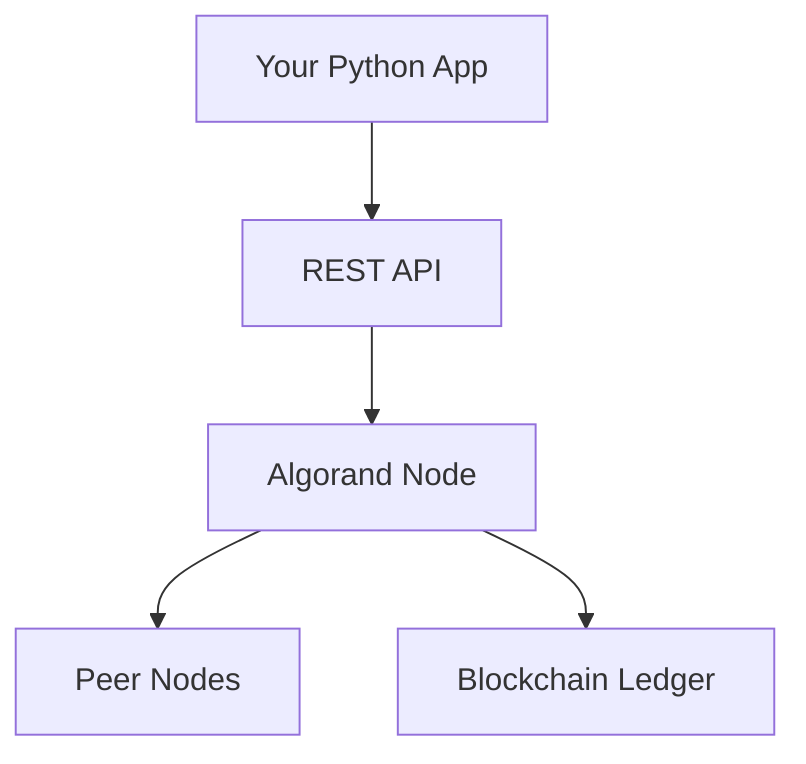
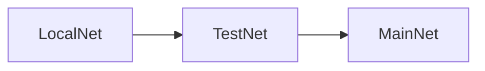
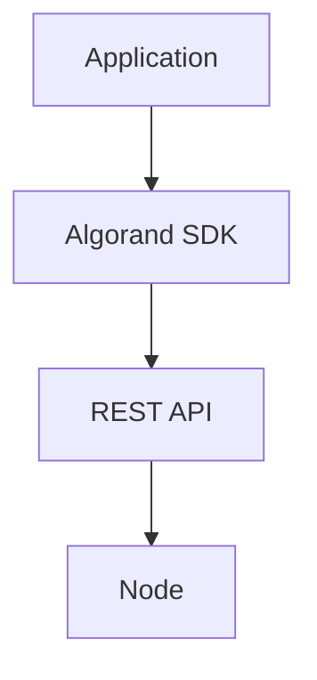
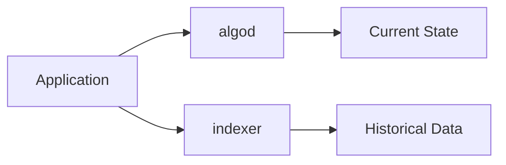
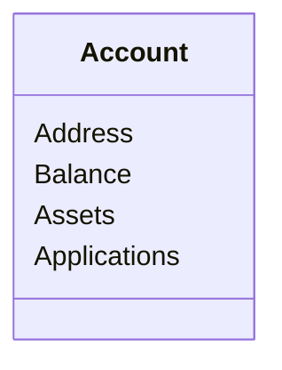
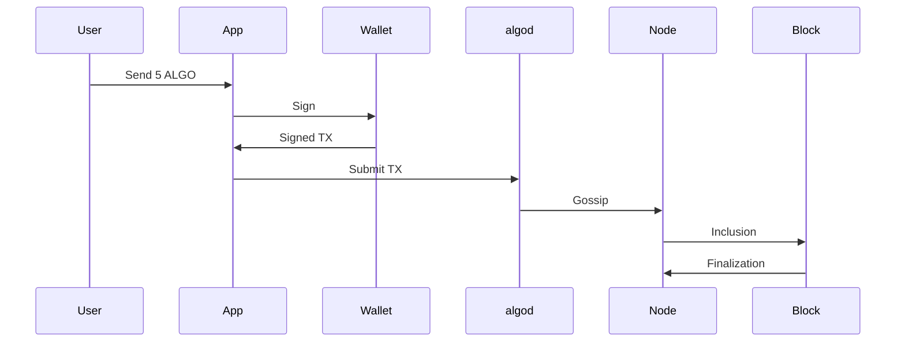
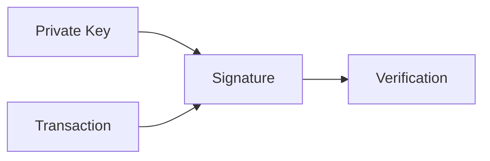
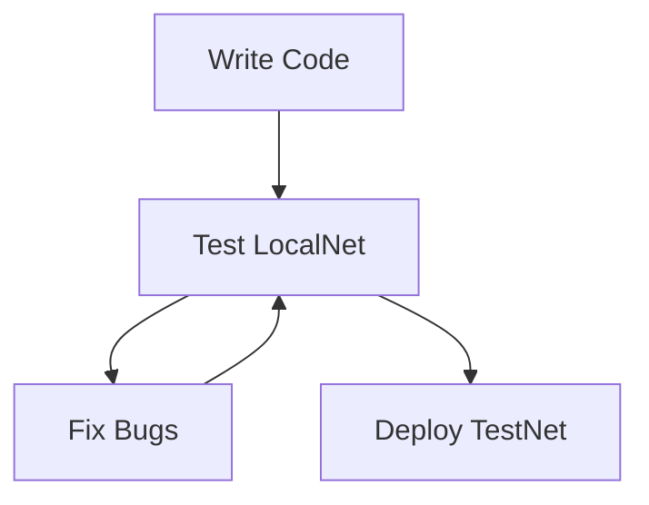

# Week 2 Study Material: Algorand Development Environment & First Programmatic Transactions

# Goal of Week 2

By the end of this week you should be able to:

- Explain what a blockchain node is
- Explain the difference between MainNet, TestNet, and LocalNet
- Understand why developers use SDKs
- Install and use AlgoKit
- Understand algod and indexer services
- Connect a Python application to Algorand
- Create, sign, and submit transactions
- Build a mental model of how applications talk to the blockchain

---

# The Big Picture

During Week 1 you learned WHAT a blockchain is.

During Week 2 you learn HOW your code talks to a blockchain.

Mental Model:

```text
Week 1 = Internet User
Week 2 = Internet Developer
```

You are moving from:

```text
Wallet User
```

To:

```text
Application Developer
```

---

# Chapter 1: What is a Node?

Definition:

A node is software that participates in the blockchain network.

Think of a node as a database server that also understands blockchain rules.

Mental Model:

```text
MySQL World
-----------
Database Server

Blockchain World
----------------
Node
```

A node:

- Stores blockchain data
- Verifies transactions
- Verifies blocks
- Communicates with peers
- Exposes APIs

---

# Node Architecture



---

# Why Not Connect Directly to Peers?

Because blockchain networking is complex.

Instead of implementing:

- peer discovery
- synchronization
- consensus participation

You use:

```text
algod API
```

which provides a clean interface.

---

# Chapter 2: MainNet vs TestNet vs LocalNet

## MainNet

Real blockchain.

Real value.

Real ALGO.

Never experiment here.

---

## TestNet

Public testing environment.

Looks like MainNet.

Uses free ALGO.

Mental Model:

```text
MainNet = Production
TestNet = Staging
```

---

## LocalNet

Runs entirely on your laptop.

Benefits:

- free
- instant
- reproducible
- isolated

Mental Model:

```text
LocalNet = localhost
```

for blockchain.

---

# Environment Comparison



Development progression:

1. Build locally
2. Test publicly
3. Deploy to production

---

# Chapter 3: What is AlgoKit?

AlgoKit is the official developer toolbox.

Think:

```text
React Developers -> Create React App

Algorand Developers -> AlgoKit
```

Responsibilities:

- Project generation
- LocalNet management
- Templates
- Development workflows
- Testing support

---

# Why Frameworks Exist

Without AlgoKit:

```text
Install Node
Install Docker
Install SDK
Configure Network
Create Accounts
Configure Tools
```

With AlgoKit:

```text
One workflow
```

Frameworks reduce cognitive load.

---

# Chapter 4: Understanding SDKs

SDK = Software Development Kit

An SDK is a library that wraps blockchain APIs.

Without SDK:

```text
Build HTTP requests manually
Encode transactions manually
Decode responses manually
```

With SDK:

```text
client.send_payment(...)
```

---

# SDK Architecture



---

# Chapter 5: algod

algod is the primary Algorand daemon.

Think:

```text
PostgreSQL -> postgres

Algorand -> algod
```

Responsibilities:

- transaction submission
- consensus participation
- block validation
- querying blockchain state

---

# Chapter 6: Indexer

Question:

Why not ask algod everything?

Because searching large blockchain histories is expensive.

Enter:

```text
Indexer
```

The indexer is optimized for searching.

Mental Model:

```text
algod = OLTP database
indexer = analytics database
```

---

# Query Architecture



---

# Chapter 7: Accounts as Objects

Most beginners think:

```text
Account = Wallet
```

Wrong.

Better model:



A wallet merely manages keys.

An account exists on-chain.

---

# Chapter 8: Transaction Lifecycle Deep Dive

A transaction goes through multiple stages.



---

# Mental Model: Courier Service

Transaction journey:

```text
Letter Created
    ↓
Signed Envelope
    ↓
Post Office
    ↓
Transport Network
    ↓
Delivered
```

Blockchain transaction:

```text
Transaction
    ↓
Signature
    ↓
Node
    ↓
Network
    ↓
Block
```

---

# Chapter 9: Signing Transactions

Question:

Why sign?

Because the network must verify ownership.

Without signatures:

```text
Anyone can spend anyone's funds.
```

With signatures:

```text
Only key owner can authorize spending.
```

---

# Signature Verification



---

# Chapter 10: LocalNet Workflow

Development loop:



---

# Hands-On Lab 1

Setup Development Environment

Tasks:

- Install Docker
- Install Python
- Install AlgoKit
- Run diagnostics

Verification:

```text
algokit doctor
```

---

# Hands-On Lab 2

Start LocalNet

Goal:

Understand local blockchain infrastructure.

Observe:

- node container
- indexer container
- explorer container

Draw a diagram showing how they interact.

---

# Hands-On Lab 3

Create a Python project.

Build:

- connect to node
- fetch balance
- print account information

---

# Hands-On Lab 4

Perform:

- account creation
- transfer transaction
- transaction confirmation

Draw transaction flow from memory.

---

# Common Beginner Confusions

## Confusion 1

Wallet != Account

Wallet manages keys.

Account exists on-chain.

---

## Confusion 2

Node != Blockchain

Node stores and serves blockchain data.

Blockchain is the shared ledger.

---

## Confusion 3

SDK != Network

SDK is merely a programming wrapper.

---

# End of Week Knowledge Check

You should be able to answer:

1. What is a node?
2. What is algod?
3. What is the indexer?
4. Why does TestNet exist?
5. Why does LocalNet exist?
6. Why use an SDK?
7. What does signing achieve?
8. What is the difference between a wallet and an account?
9. What is the transaction lifecycle?
10. Why is an indexer different from a node?

---

# End-of-Week Deliverable

Create:

```text
week2-lab-notes.md
```

Include:

- Architecture diagrams
- LocalNet setup notes
- Transaction lifecycle explanation
- Wallet vs Account explanation
- algod vs indexer comparison
- Screenshots of experiments
- Lessons learned

If you can explain every diagram from memory, you are ready for Week 3.
