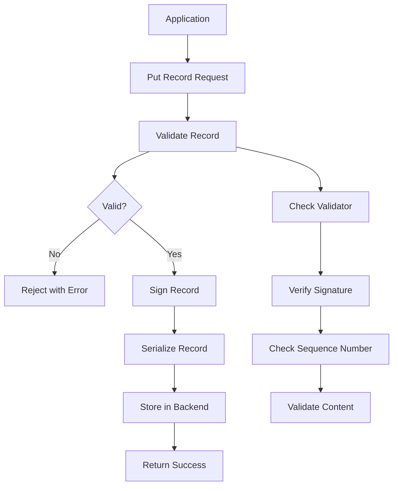
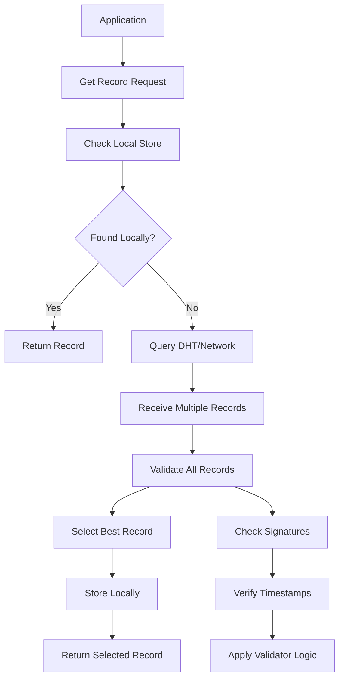
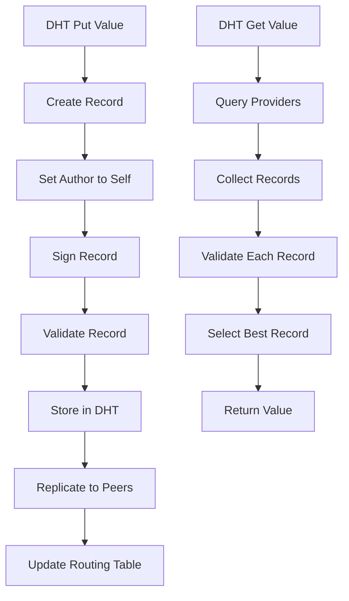
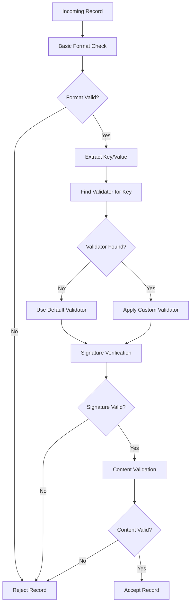

https://prod.liveshare.vsengsaas.visualstudio.com/join?9FC4EB1C14D8E41444015F1EFF1569B8488D
  https://claude.ai/public/artifacts/4a7ac0c1-baa7-44e2-9e96-c537b37c8e11
# libp2p Record Module - Complete Implementation Guide

## Table of Contents
1. [Introduction](#introduction)
2. [Why We Need the Record Module](#why-we-need-the-record-module)
3. [Use Cases](#use-cases)
4. [Problems Without Record Module](#problems-without-record-module)
5. [Architecture Overview](#architecture-overview)
6. [Core Components](#core-components)
7. [Workflow Diagrams](#workflow-diagrams)
8. [Implementation Details](#implementation-details)
9. [API Design](#api-design)
10. [Integration with DHT](#integration-with-dht)
11. [Security Considerations](#security-considerations)
12. [Testing Strategy](#testing-strategy)

## Introduction

The libp2p record module is a fundamental component that provides a standardized way to store, retrieve, and validate data records in a distributed peer-to-peer network. It serves as the backbone for content addressing, peer discovery, and distributed data storage within the libp2p ecosystem.

The record module implements a key-value store abstraction where:
- **Keys** are content identifiers (typically multihashes or paths)
- **Values** are arbitrary data with associated metadata
- **Records** combine keys, values, timestamps, and cryptographic signatures

## Why We Need the Record Module

### 1. **Data Integrity and Authenticity**
The record module ensures that data stored and retrieved in the network maintains its integrity through cryptographic signatures and validation mechanisms.

### 2. **Standardized Data Format**
It provides a consistent format for storing and transmitting data across different libp2p implementations, ensuring interoperability between Go, Rust, JavaScript, and Python implementations.

### 3. **Versioning and Conflict Resolution**
Records include timestamps and sequence numbers to handle conflicts when multiple peers attempt to update the same key simultaneously.

### 4. **Security and Trust**
The module implements signature verification and validation rules to prevent malicious actors from corrupting the distributed data store.

### 5. **Efficient Data Lookup**
It provides optimized interfaces for storing and retrieving data in distributed hash tables (DHTs) and other storage backends.

## Use Cases

### 1. **IPNS (InterPlanetary Name System)**
- Publishing mutable pointers to IPFS content
- Resolving human-readable names to content hashes
- Updating published content while maintaining the same identifier

### 2. **Peer Discovery and Routing**
- Storing peer information and addresses
- Publishing and discovering service advertisements
- Maintaining routing tables in DHT implementations

### 3. **Content Publishing**
- Publishing metadata about available content
- Advertising content availability across the network
- Creating content indexes and catalogs

### 4. **Distributed Configuration**
- Storing application-specific configuration data
- Managing distributed system parameters
- Coordinating network-wide settings

### 5. **Reputation and Trust Systems**
- Recording peer behavior and reputation scores
- Publishing trust attestations
- Maintaining blacklists and whitelists

## Problems Without Record Module

### 1. **Data Corruption and Tampering**
Without standardized validation and signing mechanisms:
- Malicious peers could inject false data
- Data integrity couldn't be verified
- No way to detect corrupted records

### 2. **Inconsistent Data Formats**
- Different implementations would use incompatible formats
- Interoperability between language implementations would break
- Custom serialization would lead to bugs and security issues

### 3. **Conflict Resolution Issues**
- Multiple peers updating the same key would create conflicts
- No standardized way to determine which update is more recent
- Network partitions could lead to permanent inconsistencies

### 4. **Security Vulnerabilities**
- No authentication of record publishers
- Vulnerable to replay attacks and data poisoning
- No mechanism to revoke or update compromised records

### 5. **Performance Problems**
- Inefficient data serialization and deserialization
- Lack of optimized storage and retrieval patterns
- No caching or validation shortcuts

## Architecture Overview

The libp2p record module follows a layered architecture:

```
┌─────────────────────────────────────┐
│          Application Layer          │
├─────────────────────────────────────┤
│           Record Store API          │
├─────────────────────────────────────┤
│         Validation Layer            │
├─────────────────────────────────────┤
│         Serialization Layer         │
├─────────────────────────────────────┤
│          Storage Backend            │
└─────────────────────────────────────┘
```

### Key Architectural Principles

1. **Separation of Concerns**: Clear separation between validation, serialization, and storage
2. **Pluggable Validators**: Support for custom validation logic per record type
3. **Multiple Storage Backends**: Abstract storage interface supporting various backends
4. **Async/Await Pattern**: Fully asynchronous API design for Python implementation
5. **Type Safety**: Strong typing using Python type hints and dataclasses

## Core Components

### 1. **Record Structure**

```python
@dataclass
class Record:
    key: bytes
    value: bytes
    author: Optional[bytes] = None  # Peer ID of the record author
    signature: Optional[bytes] = None  # Cryptographic signature
    time_received: Optional[str] = None  # RFC 3339 timestamp
    sequence: Optional[int] = None  # Sequence number for ordering
```

### 2. **Validator Interface**

```python
class RecordValidator(ABC):
    @abstractmethod
    async def validate(self, key: bytes, value: bytes) -> bool:
        """Validate a record's content"""
        pass
    
    @abstractmethod
    async def select(self, key: bytes, records: List[Record]) -> int:
        """Select the best record from multiple candidates"""
        pass
```

### 3. **Record Store Interface**

```python
class RecordStore(ABC):
    @abstractmethod
    async def get_record(self, key: bytes) -> Optional[Record]:
        """Retrieve a record by key"""
        pass
    
    @abstractmethod
    async def put_record(self, record: Record) -> None:
        """Store a record"""
        pass
    
    @abstractmethod
    async def has_record(self, key: bytes) -> bool:
        """Check if record exists"""
        pass
```

### 4. **Serialization Manager**

Handles conversion between Record objects and wire format (Protocol Buffers):

```python
class RecordSerializer:
    def serialize(self, record: Record) -> bytes:
        """Convert Record to protobuf bytes"""
        pass
    
    def deserialize(self, data: bytes) -> Record:
        """Convert protobuf bytes to Record"""
        pass
```

## Workflow Diagrams

### Record Storage Workflow



### Record Retrieval Workflow



### DHT Integration Workflow



### Validation Pipeline



## Implementation Details

### 1. **Record Validation System**

The validation system supports pluggable validators for different record types:

```python
class ValidationEngine:
    def __init__(self):
        self.validators: Dict[str, RecordValidator] = {}
        self.default_validator = DefaultValidator()
    
    def register_validator(self, namespace: str, validator: RecordValidator):
        """Register a validator for a specific key namespace"""
        self.validators[namespace] = validator
    
    async def validate_record(self, record: Record) -> bool:
        """Validate a record using appropriate validator"""
        key_str = record.key.decode('utf-8', errors='ignore')
        namespace = key_str.split('/', 1)[0] if '/' in key_str else ''
        
        validator = self.validators.get(namespace, self.default_validator)
        return await validator.validate(record.key, record.value)
```

### 2. **Signature Management**

Records are signed using the author's private key and verified using their public key:

```python
class SignatureManager:
    def __init__(self, private_key, public_key):
        self.private_key = private_key
        self.public_key = public_key
    
    def sign_record(self, record: Record) -> Record:
        """Sign a record with the private key"""
        message = self._create_signing_message(record)
        signature = self.private_key.sign(message)
        
        record.signature = signature
        record.author = self.public_key.peer_id()
        return record
    
    def verify_signature(self, record: Record) -> bool:
        """Verify a record's signature"""
        if not record.signature or not record.author:
            return False
        
        message = self._create_signing_message(record)
        public_key = self._get_public_key(record.author)
        return public_key.verify(message, record.signature)
```

### 3. **Storage Backend Abstraction**

Multiple storage backends can be supported:

```python
class MemoryRecordStore(RecordStore):
    def __init__(self):
        self.records: Dict[bytes, Record] = {}
    
    async def get_record(self, key: bytes) -> Optional[Record]:
        return self.records.get(key)
    
    async def put_record(self, record: Record) -> None:
        # Validate before storing
        if await self._validate_record(record):
            self.records[record.key] = record
        else:
            raise ValueError("Invalid record")

class DHTRecordStore(RecordStore):
    def __init__(self, dht_client):
        self.dht = dht_client
    
    async def get_record(self, key: bytes) -> Optional[Record]:
        raw_data = await self.dht.get_value(key)
        if raw_data:
            return RecordSerializer().deserialize(raw_data)
        return None
    
    async def put_record(self, record: Record) -> None:
        serialized = RecordSerializer().serialize(record)
        await self.dht.put_value(record.key, serialized)
```

### 4. **Conflict Resolution**

When multiple records exist for the same key, the system must select the best one:

```python
class SequenceValidator(RecordValidator):
    async def select(self, key: bytes, records: List[Record]) -> int:
        """Select record with highest sequence number"""
        if not records:
            return -1
        
        best_idx = 0
        best_seq = records[0].sequence or 0
        
        for i, record in enumerate(records):
            seq = record.sequence or 0
            if seq > best_seq:
                best_seq = seq
                best_idx = i
        
        return best_idx
```

## API Design

### High-Level API

```python
class RecordManager:
    def __init__(self, store: RecordStore, validator: ValidationEngine):
        self.store = store
        self.validator = validator
        self.serializer = RecordSerializer()
    
    async def put(self, key: str, value: bytes, **kwargs) -> None:
        """Store a record"""
        record = Record(
            key=key.encode(),
            value=value,
            sequence=kwargs.get('sequence'),
            time_received=datetime.utcnow().isoformat()
        )
        
        # Sign the record
        if self.private_key:
            record = self.sign_record(record)
        
        # Validate before storing
        if await self.validator.validate_record(record):
            await self.store.put_record(record)
        else:
            raise ValueError("Record validation failed")
    
    async def get(self, key: str) -> Optional[bytes]:
        """Retrieve a record's value"""
        record = await self.store.get_record(key.encode())
        return record.value if record else None
    
    async def get_record(self, key: str) -> Optional[Record]:
        """Retrieve full record"""
        return await self.store.get_record(key.encode())
```

### Integration with py-libp2p

```python
# In py-libp2p host
class Libp2pHost:
    def __init__(self):
        # ... other initialization
        self.record_manager = RecordManager(
            store=DHTRecordStore(self.dht),
            validator=ValidationEngine()
        )
        
        # Register IPNS validator
        self.record_manager.validator.register_validator(
            "ipns", IPNSValidator()
        )
    
    async def put_record(self, key: str, value: bytes) -> None:
        """Public API for applications"""
        await self.record_manager.put(key, value)
    
    async def get_record(self, key: str) -> Optional[bytes]:
        """Public API for applications"""
        return await self.record_manager.get(key)
```

## Integration with DHT

The record module integrates tightly with the DHT for distributed storage:

### DHT Provider Records

```python
class ProviderRecord:
    """Special record type for content providers"""
    def __init__(self, content_hash: bytes, provider_peer: PeerID):
        self.key = f"/providers/{content_hash.hex()}".encode()
        self.value = provider_peer.to_bytes()
        
class DHTProviderStore:
    async def add_provider(self, content_hash: bytes, peer_id: PeerID):
        """Add a provider record to DHT"""
        record = ProviderRecord(content_hash, peer_id)
        await self.record_manager.put_record(record)
    
    async def get_providers(self, content_hash: bytes) -> List[PeerID]:
        """Get all providers for content"""
        key = f"/providers/{content_hash.hex()}"
        records = await self.dht.get_closest_peers(key)
        return [self._extract_peer_id(record) for record in records]
```

## Security Considerations

### 1. **Signature Verification**
- All records must be signed by their authors
- Public key cryptography ensures authenticity
- Replay attack protection through sequence numbers

### 2. **Validation Rules**
- Custom validators can implement domain-specific security rules
- Content validation prevents malformed data injection
- Size limits prevent DoS attacks

### 3. **Access Control**
- Record namespaces can have specific permission models
- IPNS records require author's private key
- Validator-based access control for sensitive data

### 4. **Network Security**
- Rate limiting for record storage operations
- Peer reputation integration
- Blacklist/whitelist support for malicious peers

## Testing Strategy

### 1. **Unit Tests**
```python
class TestRecordManager:
    async def test_put_get_record(self):
        """Test basic record storage and retrieval"""
        manager = RecordManager(MemoryRecordStore(), ValidationEngine())
        
        await manager.put("test-key", b"test-value")
        value = await manager.get("test-key")
        
        assert value == b"test-value"
    
    async def test_signature_validation(self):
        """Test signature verification"""
        # Test with valid signature
        # Test with invalid signature
        # Test with missing signature
```

### 2. **Integration Tests**
```python
class TestDHTIntegration:
    async def test_dht_record_storage(self):
        """Test record storage via DHT"""
        # Set up DHT network
        # Store record on one node
        # Retrieve from another node
        # Verify record integrity
```

### 3. **Performance Tests**
- Record serialization/deserialization benchmarks
- Storage backend performance comparison
- Network propagation latency measurements
- Validation overhead analysis

### 4. **Security Tests**
- Signature forgery attempts
- Malformed record injection
- Replay attack simulation
- DoS attack resistance

## Conclusion

The libp2p record module is essential for building secure, interoperable, and efficient distributed applications. By implementing this module in py-libp2p with the architecture and components described above, you'll provide Python developers with the same powerful record management capabilities available in other libp2p implementations.

The modular design allows for easy extension and customization while maintaining compatibility with the broader libp2p ecosystem. The async/await patterns and strong typing make it well-suited for modern Python applications.

Remember to thoroughly test all components, especially the validation and security mechanisms, as they are critical for the overall security of applications built on libp2p.
