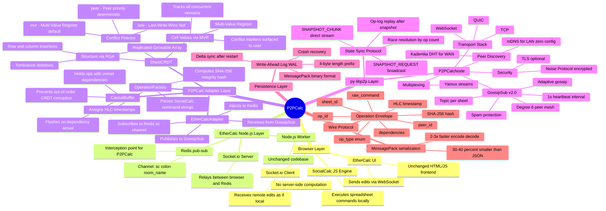
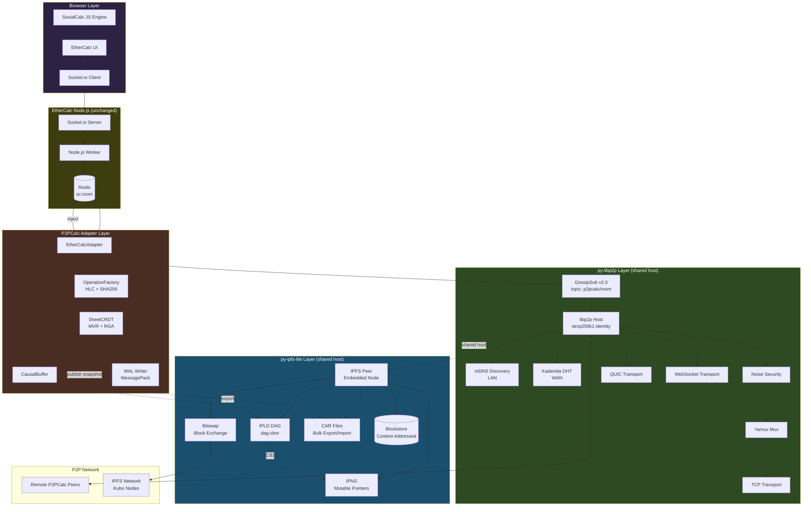

# P2PCalc — Complete Technical Guide

> **Decentralised EtherCalc Collaboration over py-libp2p GossipSub**
> with full integration guide for `py-ipfs-lite`

---

## Table of Contents

1. [What is P2PCalc?](#1-what-is-p2pcalc)
2. [The Problem it Solves](#2-the-problem-it-solves)
3. [Use Cases](#3-use-cases)
4. [How it Works — The Core Idea](#4-how-it-works--the-core-idea)
5. [Architecture Deep Dive](#5-architecture-deep-dive)
6. [Mind Map — Full System Flow](#6-mind-map--full-system-flow)
7. [Core Innovations Explained](#7-core-innovations-explained)
8. [Source File Walkthrough](#8-source-file-walkthrough)
9. [py-ipfs-lite Integration Guide](#9-py-ipfs-lite-integration-guide)
10. [Integration Architecture Diagram](#10-integration-architecture-diagram)
11. [References](#11-references)

---

## 1. What is P2PCalc?

**P2PCalc** is a decentralised, peer-to-peer collaborative spreadsheet system. It is built as an example application on top of **py-libp2p** — the Python implementation of the libp2p networking stack.

At its heart, P2PCalc takes **EtherCalc** (an open-source collaborative spreadsheet built on SocialCalc) and replaces its centralised Redis pub-sub relay with a fully decentralised **GossipSub** message-passing layer.

> Think of it as: *"Google Sheets without Google"* — multiple peers edit the same spreadsheet simultaneously with no central server.

**Key properties:**
- ✅ No central server — no single point of failure
- ✅ Works on LANs (mDNS), across the internet (DHT), or offline
- ✅ Browser UI is completely unchanged (EtherCalc frontend still works)
- ✅ CRDT-based conflict resolution — no silent data loss
- ✅ Crash recovery via local Write-Ahead Log (WAL)

---

## 2. The Problem it Solves

### The EtherCalc Centralised Architecture

Before P2PCalc, EtherCalc's collaboration flow looked like this:

```
Browser A → WebSocket → Node.js Server → Redis pub-sub → Node.js Server → WebSocket → Browser B
```

This has three fundamental problems:

| Problem | Description |
|---|---|
| **Single point of failure** | Server crash = collaboration dead. Pending edits are lost. |
| **No offline-first capability** | Disconnect = cannot edit. No reconciliation mechanism on reconnect. |
| **Centralised trust** | All edits pass through one server. Fatal for civic-tech, disaster response, rural deployments. |

### The P2PCalc Fix

P2PCalc intercepts **exactly** the Redis pub-sub layer — the only place EtherCalc's components talk to each other — and replaces it with a decentralised GossipSub mesh:

```
Before (centralised):
  Browser → WS → Node.js → Redis → Node.js → WS → Browser

After (P2PCalc):
  Browser → WS → Node.js → Redis → P2PCalc Adapter
                                         │
                                    GossipSub topic
                                    p2pcalc/<room>
                                         │
                               Remote P2PCalc Adapter
                                         │
                          Redis → Node.js → WS → Browser
```

**The browser never knows the difference.**

---

## 3. Use Cases

### 🌍 Disaster Response & Emergency Operations
Field teams with intermittent connectivity can co-edit logistics spreadsheets offline. When connectivity returns, their edits converge automatically via the CRDT layer without a coordinator.

### 🏘️ Rural & Low-Connectivity Deployments
mDNS-based LAN discovery enables collaboration between devices on the same local network — no internet required. Perfect for villages, rural clinics, schools.

### 🏛️ Civic Tech & Government Transparency
Open data collaborators who distrust a single hosting authority can co-edit budget spreadsheets, compliance reports, or public datasets with no infrastructure dependency.

### 📚 Academic Research & Data Science
Small research teams can maintain shared data notebooks across institutions without relying on proprietary cloud services like Google Sheets.

### 🔒 Privacy-Sensitive Collaboration
Medical records, legal documents, or financial models that cannot be sent to a cloud provider can be collaboratively edited on a private peer mesh.

### 🧪 Distributed Systems Education
P2PCalc is an excellent teaching example of: CRDT theory, GossipSub pub-sub, libp2p architecture, hybrid logical clocks, and causal consistency — all in one contained Python project.

---

## 4. How it Works — The Core Idea

### The Key Insight

EtherCalc's server does **not compute** — it only **relays**. Every SocialCalc command is executed client-side in the browser's JavaScript engine. The Node.js server is a glorified message bus.

```
SocialCalc commands look like:
  "set A1 value 42"
  "set B2 formula =SUM(A1:A5)"
  "insertrow 3 1"
  "deleterow 5 1"
```

If you can replace the message bus with a decentralised one, you get peer-to-peer collaboration for free — no changes to the UI, no changes to the browser code.

### The Interception Point

EtherCalc uses Redis channels named `sc:<room_name>` (one per spreadsheet room).

P2PCalc's **Adapter** (`adapter.py`) does this:

1. **Subscribes** to `sc:<room_name>` — reads local edits from EtherCalc
2. **Wraps** each command into a `P2PCalc Operation` (with HLC timestamp, peer_id, integrity hash)
3. **Broadcasts** the operation via GossipSub on topic `p2pcalc/<room_name>`
4. **Receives** operations from remote GossipSub peers
5. **Injects** them back into the same Redis channel
6. EtherCalc's Socket.io layer delivers them to browsers as if they were local

### The CRDT Layer

Before injecting remote operations, the adapter runs them through a **SheetCRDT** engine that handles:
- Out-of-order delivery (causal buffering)
- Concurrent cell edits (Multi-Value Register)
- Concurrent row/column insertions (Replicated Growable Array)
- Deduplication (prevents echo loops)

---

## 5. Architecture Deep Dive

```
┌──────────────────────────────────────────────────────────────────┐
│                     BROWSER LAYER (unchanged)                    │
│                                                                  │
│   SocialCalc JS Engine ←→ EtherCalc UI ←→ Socket.io Client     │
└─────────────────────────────────┬────────────────────────────────┘
                                  │ WebSocket
┌─────────────────────────────────┴────────────────────────────────┐
│                  ETHERCALC NODE.JS LAYER (unchanged)             │
│                                                                  │
│   Socket.io Server ←→ Node.js Worker ←→ Redis Client            │
└─────────────────────────────────┬────────────────────────────────┘
                                  │ Redis pub-sub  sc:<room>
┌─────────────────────────────────┴────────────────────────────────┐
│              P2PCALC ADAPTER LAYER  (adapter.py)                 │
│                                                                  │
│   Redis Subscriber         Redis Publisher                       │
│   (reads local edits)      (injects remote edits)               │
│          │                         ▲                             │
│          ▼                         │                             │
│   OperationFactory          Operation.from_bytes()               │
│   (parse SocialCalc cmd)    (MessagePack deserialise)            │
│          │                         │                             │
│          ▼                         │                             │
│   SheetCRDT.apply()         CausalBuffer                        │
│   (local optimistic apply)  (hold until deps arrive)            │
│          │                         │                             │
└──────────┼─────────────────────────┼────────────────────────────┘
           │ GossipSub publish       │ GossipSub subscribe
           ▼                         │
┌──────────────────────────────────────────────────────────────────┐
│             py-libp2p GOSSIPSUB LAYER  (p2p_node.py)            │
│                                                                  │
│   Topic: p2pcalc/<room_name>                                     │
│   Peer discovery: mDNS (LAN) / Kademlia DHT (WAN)               │
│   Transport: TCP / WebSocket / QUIC                              │
│   Security: Noise protocol (encrypted + authenticated)           │
│   Multiplexing: Yamux                                            │
│   Heartbeat: 1s (tuned for collaborative editing latency)        │
│   Message validation: SHA-256 integrity check before forwarding  │
└─────────────────────────────────┬────────────────────────────────┘
                                  │ mesh propagation
                                  ▼
                    ┌─────────────────────────────┐
                    │   Remote P2PCalc Peers       │
                    │   (same full stack)          │
                    └─────────────────────────────┘
```

### State Sync (Late Joiners)

When a new peer joins a room, it cannot replay the full operation log. Instead:

```
New Peer                          Existing Peer
    │                                   │
    │──── SNAPSHOT_REQUEST (GossipSub)──→│
    │                                   │
    │←──── SNAPSHOT_CHUNK (libp2p stream)─│
    │←──── SNAPSHOT_CHUNK ───────────────│
    │←──── SNAPSHOT_DONE ────────────────│
    │                                   │
    │  (apply snapshot)                 │
    │  (replay buffered ops since snap) │
    │                                   │
    │   ←──── ongoing operations ────   │
```

---

## 6. Mind Map — Full System Flow



---

## 7. Core Innovations Explained

### 7.1 Hybrid Logical Clocks (HLC)

**The problem with wall clocks:** Two peers on different machines have clocks that drift. A peer editing offline and reconnecting will have a stale clock reading. Last-write-wins with wall clocks silently corrupts data under partition.

**The HLC solution:** Combines physical time (human-readable) with a logical counter (causal ordering when clocks agree).

```
HLC = (physical_time_ms, logical_counter, peer_id)

Rules:
  - On local event:      hlc = max(physical_now, hlc.pt) with counter++
  - On receive event:    hlc = max(physical_now, remote.pt, hlc.pt) with counter reset
  - Two events ordered by: (pt, counter, peer_id) — deterministic tiebreaker
```

Result: **causally consistent ordering** across peers with no clock sync protocol.

---

### 7.2 Multi-Value Register (MVR) for Cell Conflicts

**The problem with LWW:** Alice and Bob both edit cell A1 simultaneously. Under Last-Write-Wins, one edit silently disappears. This is **data loss disguised as a feature**.

**The MVR solution:**

```
Alice writes A1 = "100" at HLC(t1, 0, alice)
Bob   writes A1 = "200" at HLC(t1, 0, bob)   ← concurrent (neither causally precedes)

MVR tracks BOTH:
  CellState.candidates = [
    CellVersion(value="100", hlc=(t1,0), peer_id="alice"),
    CellVersion(value="200", hlc=(t1,0), peer_id="bob")
  ]

Conflict marker injected into spreadsheet:
  Cell A1_conflict = "CONFLICT: 100 | 200 — please resolve"
```

When one peer's write **causally follows** both (has higher HLC), it automatically resolves the conflict.

---

### 7.3 Replicated Growable Array (RGA) for Structural Operations

**The problem:** Peer A inserts row at position 3. Peer B deletes row 3 simultaneously. *Which row 3 does B mean?*

Operational Transformation (OT) tries to rewrite operations against each other — notoriously hard to get right.

**The RGA solution:** Track *intent* rather than *absolute effect*.
- Each structural position has a stable identifier
- Concurrent insertions at the same position: ordered by `peer_id` as tiebreaker
- Deletions use **tombstones** — the position is invisible but preserved
- All peers converge to identical structure without coordination

---

### 7.4 Causal Buffering

**The problem:** GossipSub provides eventual delivery. Operations may arrive out of order after reconnects. Applying out-of-order ops corrupts CRDT state.

**The solution:** Each operation records its *dependency* (the last op the issuing peer observed). The `CausalBuffer` holds ops with unmet dependencies and flushes them in dependency order when the missing op arrives.

```python
# Simplified logic:
if op.depends_on in seen_ops:
    apply(op)
else:
    causal_buffer[op.depends_on].append(op)
    # When depends_on arrives → flush buffer
```

---

### 7.5 Two-Phase Late-Joiner State Sync

**The problem:** Replaying the full operation log from genesis is impractical for long-lived sessions.

**Phase 1 — Snapshot:** Broadcast `SNAPSHOT_REQUEST` via GossipSub. Any peer responds via direct libp2p stream with `SNAPSHOT_CHUNK` operations (64KB pieces). Multiple responders → choose the one with the highest op count (most history). Tie → prefer lower `peer_id`.

**Phase 2 — Delta Replay:** After applying the snapshot, replay any operations that arrived *after* the snapshot was taken. The snapshot embeds `op_log_from` to indicate the starting point.

---

### 7.6 Write-Ahead Log (WAL) for Crash Recovery

Every applied operation is persisted to a local WAL file in **MessagePack** format with 4-byte length prefix. On crash recovery:

1. Replay the local WAL → restore last known state
2. Request a snapshot delta *since the WAL's last entry* (not full session history)
3. Works even if no other peers are online (local recovery)

This mirrors how distributed databases (CockroachDB, etcd) survive crashes.

---

### 7.7 MessagePack over JSON

| Metric | JSON | MessagePack |
|---|---|---|
| Size | 100% (baseline) | ~60–70% (30–40% smaller) |
| Encode speed | 1× | 2–3× faster |
| Decode speed | 1× | 2–3× faster |
| Human readable | ✅ | ❌ |

For collaborative editing (tens of ops/second/peer), this directly reduces mesh bandwidth and allows shortening the heartbeat from 2s to 1s without network saturation.

---

### 7.8 Operation Integrity Verification

Every operation carries a `SHA-256` content hash of its key fields:

```python
hash_input = f"{sheet_id}:{raw_command}:{peer_id}:{op_id}"
content_hash = sha256(hash_input.encode()).hexdigest()
```

The **GossipSub message validator hook** rejects operations that fail integrity checks *before* they are forwarded to other peers — preventing malformed operations from polluting the mesh.

---

## 8. Source File Walkthrough

| File | Role | Key Classes |
|---|---|---|
| [`operation.py`](file:///Users/sumanjeet/code/p2pcal/py-libp2p/examples/p2pcalc/p2pcalc/operation.py) | Wire protocol, HLC, MessagePack | `HLC`, `Operation`, `OperationFactory`, `OpType` |
| [`crdt.py`](file:///Users/sumanjeet/code/p2pcal/py-libp2p/examples/p2pcalc/p2pcalc/crdt.py) | MVR + RGA conflict resolution | `SheetCRDT`, `CellState`, `CellVersion`, `RGANode`, `ConflictPolicy` |
| [`adapter.py`](file:///Users/sumanjeet/code/p2pcal/py-libp2p/examples/p2pcalc/p2pcalc/adapter.py) | EtherCalc ↔ GossipSub bridge | `EtherCalcAdapter`, `CausalBuffer` |
| [`p2p_node.py`](file:///Users/sumanjeet/code/p2pcal/py-libp2p/examples/p2pcalc/p2pcalc/p2p_node.py) | libp2p host, GossipSub v2.0, state sync | `P2PCalcNode` |
| [`state_sync.py`](file:///Users/sumanjeet/code/p2pcal/py-libp2p/examples/p2pcalc/p2pcalc/state_sync.py) | Snapshot assembly, WAL persistence | `StateSyncManager`, `WALWriter` |
| [`main.py`](file:///Users/sumanjeet/code/p2pcal/py-libp2p/examples/p2pcalc/p2pcalc/main.py) | CLI entrypoint | `main()` |

### py-libp2p Modules Used

| py-libp2p Module | Purpose in P2PCalc |
|---|---|
| `libp2p.pubsub.gossipsub.GossipSub` | Decentralised pub-sub mesh |
| `libp2p.pubsub.pubsub.Pubsub` | Base pub-sub layer |
| `libp2p.discovery.mdns` | Zero-config LAN peer discovery |
| `libp2p.kad_dht` | WAN peer discovery |
| `libp2p.security.noise` | Encrypted + authenticated transport |
| `libp2p.stream_muxer.yamux` | Multiplexed streams per connection |
| `libp2p.crypto.secp256k1` | Peer identity key generation |
| `libp2p.transport.tcp` | TCP transport |
| `libp2p.transport.websocket` | WebSocket transport |
| `libp2p.transport.quic` | QUIC transport |

---

## 9. py-ipfs-lite Integration Guide

### What is py-ipfs-lite?

**[py-ipfs-lite](https://github.com/sumanjeet0012/py-ipfs-lite)** is a lightweight, embeddable Python IPFS peer built on top of `py-libp2p`. It provides core IPFS capabilities without a heavy Kubo daemon:

| Feature | Description |
|---|---|
| **Embedded IPFS Node** | Full IPFS peer in-process using `trio` async |
| **Bitswap** | Block exchange with Kubo daemons |
| **KadDHT + IPNI Routing** | Content routing via DHT + `cid.contact` delegated HTTP |
| **IPLD DAG Support** | `dag-pb`, `dag-cbor`, `dag-json` |
| **CAR Files** | Export/import full DAGs as Content Addressable aRchives |
| **IPNS** | Cryptographically signed mutable pointers |
| **FastAPI HTTP Daemon** | Kubo-compatible `/api/v0` endpoints |
| **Prometheus Metrics** | Observability for GC, block sizes, Bitswap traffic |

### Why Integrate py-ipfs-lite with P2PCalc?

The P2PCalc README explicitly lists **"IPFS snapshot storage for durable shared state"** as a planned feature. py-ipfs-lite is the **natural fit** because:

1. Both are built on `py-libp2p` — they share the same libp2p host, DHT, and transport stack
2. No Kubo daemon needed — lightweight, embeddable, same process
3. Content-addressable snapshots = **tamper-evident** shared history
4. CAR files = efficient bulk state transfer between peers
5. IPNS = mutable pointer to "current canonical snapshot" for a room

### Integration Points

#### Point 1: IPFS-Backed Snapshot Storage

**Current limitation:** Snapshots are sent point-to-point via direct libp2p streams. If the sender goes offline, late joiners cannot get a snapshot.

**With py-ipfs-lite:** Snapshots are stored on IPFS as content-addressed blocks. Any peer (or IPFS gateway) can serve them. Snapshots become **persistent and globally available**.

```python
# In state_sync.py — enhanced with py-ipfs-lite

import trio
from py_ipfs_lite.peer import Peer as IPFSPeer
from py_ipfs_lite.config import Config as IPFSConfig
import json

class IPFSStateSyncManager:
    def __init__(self, sheet_crdt: SheetCRDT, ipfs_peer: IPFSPeer):
        self.crdt = sheet_crdt
        self.ipfs = ipfs_peer

    async def publish_snapshot_to_ipfs(self, room_name: str) -> str:
        """Serialise current CRDT state and pin it to IPFS."""
        snapshot_data = self.crdt.to_snapshot_dict()
        snapshot_bytes = json.dumps(snapshot_data).encode()

        # Add snapshot to IPFS — returns a CID
        cid = await self.ipfs.add_bytes(snapshot_bytes)
        return str(cid)

    async def load_snapshot_from_ipfs(self, cid: str) -> dict:
        """Fetch a snapshot from IPFS by CID."""
        snapshot_bytes = await self.ipfs.get_bytes(cid)
        return json.loads(snapshot_bytes)
```

#### Point 2: IPNS Mutable Pointer for "Current Snapshot"

**The problem:** Every time a new snapshot is published, peers need to know the new CID. Without IPNS, they would need to gossip the CID manually.

**With py-ipfs-lite IPNS:** Each peer publishes an IPNS record pointing to its latest snapshot CID. Other peers can resolve `ipns://<peer_id>` to always get the latest snapshot.

```python
async def update_ipns_snapshot_pointer(
    self, room_name: str, snapshot_cid: str, ipfs_peer: IPFSPeer
):
    """Update IPNS record so peers can discover our latest snapshot."""
    # Publish IPNS pointer: /ipns/<our_peer_id> → /ipfs/<snapshot_cid>
    await ipfs_peer.name_publish(
        value=f"/ipfs/{snapshot_cid}",
        key=f"p2pcalc/{room_name}",   # named key per room
        lifetime="24h",
        ttl="1h"
    )

async def resolve_peer_snapshot(
    self, remote_peer_id: str, room_name: str, ipfs_peer: IPFSPeer
) -> str:
    """Resolve another peer's latest snapshot CID via IPNS."""
    ipns_path = f"/ipns/{remote_peer_id}/p2pcalc/{room_name}"
    resolved_cid = await ipfs_peer.name_resolve(ipns_path)
    return resolved_cid
```

#### Point 3: CAR File Export for Bulk State Transfer

Instead of transferring snapshot JSON over libp2p streams chunk-by-chunk, the full CRDT state (including op-log) can be exported as a **CARv1** file and added to IPFS in one operation.

```python
from py_ipfs_lite.car import export_car, import_car

async def export_room_to_car(
    self, room_name: str, output_path: str, ipfs_peer: IPFSPeer
) -> str:
    """Export the full room state as a CAR file and pin to IPFS."""
    snapshot = self.crdt.to_snapshot_dict()
    op_log = self.wal.read_all()

    bundle = {
        "snapshot": snapshot,
        "op_log": op_log,
        "room": room_name,
        "version": 1,
    }

    # Build an IPLD DAG node from the bundle
    root_cid = await ipfs_peer.dag_put(bundle, codec="dag-cbor")

    # Export as CAR file
    await export_car(ipfs_peer, root_cid, output_path)
    return str(root_cid)

async def import_room_from_car(
    self, car_path: str, ipfs_peer: IPFSPeer
) -> dict:
    """Import room state from a CAR file."""
    root_cid = await import_car(ipfs_peer, car_path)
    bundle = await ipfs_peer.dag_get(root_cid)
    return bundle
```

#### Point 4: Shared libp2p Host (No Duplicate Overhead)

The most elegant integration: **P2PCalc and py-ipfs-lite share a single libp2p Host**. This means one set of connections, one DHT, one peer identity — no overhead duplication.

```python
# In p2p_node.py — shared host approach

import libp2p
from libp2p.crypto.secp256k1 import create_new_key_pair
from py_ipfs_lite.peer import Peer as IPFSPeer
from py_ipfs_lite.config import Config as IPFSConfig

async def create_shared_node(port: int, room_names: list[str]):
    """
    Create one libp2p host serving both P2PCalc and py-ipfs-lite.
    Both share: same peer_id, same DHT routing table, same transport connections.
    """
    key_pair = create_new_key_pair()

    # Create the libp2p host normally
    host = await libp2p.new_host(
        key_pair=key_pair,
        listen_addrs=[f"/ip4/0.0.0.0/tcp/{port}"],
        security=[("noise", ...)],
        muxers=[("yamux", ...)],
    )

    # py-ipfs-lite reuses the same host
    ipfs_config = IPFSConfig(
        existing_host=host,  # <── shared host, no new connections
        offline=False,
    )
    ipfs_peer = IPFSPeer(ipfs_config)
    await ipfs_peer.start()

    # P2PCalc node uses the same host
    p2pcalc_node = P2PCalcNode(host=host, room_names=room_names)
    await p2pcalc_node.start()

    return host, ipfs_peer, p2pcalc_node
```

#### Point 5: IPLD DAG for Versioned Spreadsheet History

IPLD DAGs are **immutable, content-addressed, and linked** — perfect for representing spreadsheet version history as a chain:

```python
async def commit_snapshot_as_dag(
    self,
    room_name: str,
    snapshot: dict,
    previous_cid: str | None,
    ipfs_peer: IPFSPeer
) -> str:
    """
    Commit a spreadsheet snapshot as an IPLD DAG node.
    Each commit links to the previous — forming an immutable history chain.

    DAG structure:
        {
          "room": "my-sheet",
          "timestamp": 1720000000000,
          "snapshot": { ... cell state ... },
          "op_count": 142,
          "previous": CID("/ipfs/bafyreib..."),   ← link to previous commit
        }
    """
    dag_node = {
        "room": room_name,
        "timestamp": int(time.time() * 1000),
        "snapshot": snapshot,
        "op_count": self.crdt.op_count,
    }

    if previous_cid:
        # IPLD CID link — makes this a proper DAG (directed acyclic graph)
        dag_node["previous"] = {"/": previous_cid}

    # dag-cbor codec for compact binary encoding
    commit_cid = await ipfs_peer.dag_put(dag_node, codec="dag-cbor")
    return str(commit_cid)
```

This gives P2PCalc a **tamper-evident, git-like version history** for every spreadsheet room.

#### Point 6: Bitswap for Fast Block Distribution

When multiple peers need the same snapshot simultaneously (e.g., three peers join a room at the same time), IPFS Bitswap distributes blocks efficiently across the swarm — far more efficient than each peer independently requesting from the same source.

```python
async def propagate_snapshot_via_bitswap(
    self, snapshot_cid: str, ipfs_peer: IPFSPeer
):
    """
    After publishing a snapshot, announce it to the Bitswap layer.
    Other peers with the CID will automatically get blocks from us
    via Bitswap's want-list protocol — no explicit coordination needed.
    """
    # Announce we have this block to the DHT
    await ipfs_peer.provide(snapshot_cid)
    # Now any peer that issues ipfs_peer.get(cid) will receive it from us
```

---

## 10. Integration Architecture Diagram



---

## 10.1 Complete Integration: Phased Roadmap

### Phase 1 — IPFS Snapshot Storage *(implements the stated TODO)*

**Goal:** Replace point-to-point snapshot streams with IPFS-backed persistent snapshots.

- `state_sync.py`: Add `IPFSStateSyncManager` alongside existing `StateSyncManager`
- `p2p_node.py`: After every N operations (configurable), serialize CRDT and `ipfs.add()` the snapshot
- `p2p_node.py`: On `SNAPSHOT_REQUEST`, publish the latest snapshot CID via GossipSub instead of streaming chunks
- Receivers fetch via `ipfs.get(cid)` — works even if the sender goes offline

**Effort:** ~200 LOC. No changes to EtherCalc or the browser layer.

---

### Phase 2 — IPNS Room Discovery

**Goal:** Peers can discover the latest snapshot for a room without prior knowledge of who has it.

- Each peer maintains an IPNS key named `p2pcalc/<room_name>`
- On snapshot publish → `ipfs.name.publish(/ipfs/<cid>, key=p2pcalc/<room>)`
- New joiners resolve `ipns://<bootstrap_peer_id>` to find the latest snapshot CID
- Eliminates the need for `SNAPSHOT_REQUEST` gossip in many cases

---

### Phase 3 — Versioned DAG History

**Goal:** Every snapshot commit forms an IPLD DAG chain — tamper-evident, inspectable version history.

- Each commit node links to `previous` via IPLD CID link
- Peers can walk the DAG to find common ancestors
- Enables "time-travel": restore any historical state by fetching its CID
- Enables offline auditing: export the full DAG as a CAR file, share it

---

### Phase 4 — Shared libp2p Host

**Goal:** P2PCalc and py-ipfs-lite share one libp2p Host — zero overhead.

- Modify `p2p_node.py`'s `new_node()` to accept an optional `existing_host`
- py-ipfs-lite `Config` accepts `existing_host`
- Result: one TCP connection to each peer serves both P2PCalc GossipSub and IPFS Bitswap

---

## 11. References

| Topic | Source |
|---|---|
| Hybrid Logical Clocks | Kulkarni et al., *Logical Physical Clocks and Consistent Snapshots in Globally Distributed Databases*, 2014 |
| CRDTs | Shapiro et al., *Conflict-Free Replicated Data Types*, INRIA 2011 |
| RGA | Roh et al., *Replicated Abstract Data Types: Building Blocks for Collaborative Applications*, 2011 |
| EtherCalc internals | Tan et al., *From SocialCalc to EtherCalc*, AOSA Volume 2, 2012 |
| GossipSub spec | [libp2p/specs/pubsub/gossipsub](https://github.com/libp2p/specs/tree/master/pubsub/gossipsub) |
| py-libp2p source | [libp2p/py-libp2p](https://github.com/libp2p/py-libp2p) |
| py-ipfs-lite source | [sumanjeet0012/py-ipfs-lite](https://github.com/sumanjeet0012/py-ipfs-lite) |
| IPLD spec | [ipld.io](https://ipld.io) |
| CAR format | [ipld.io/specs/transport/car/](https://ipld.io/specs/transport/car/) |
| IPNS spec | [specs.ipfs.tech/ipns/](https://specs.ipfs.tech/ipns/) |

---

*Generated: July 2026 | P2PCalc is part of [DMP 2026 #34](https://github.com/seetadev/py-libp2p/issues/34)*
